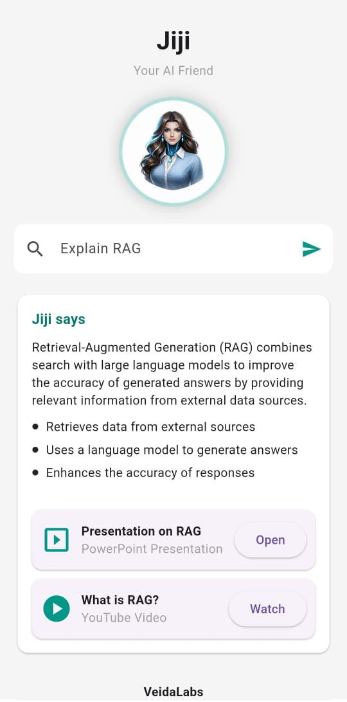

# Learn with Jiji 

A Flutter UI project showcasing **Jiji**, an AI assistant interface designed with a clean, modern layout.

---

## Features

- AI assistant style UI
- Circular avatar using asset image
- Search input field
- Informational response card
- Resource cards with action buttons
- Snackbars on button click (Coming soon)
- Responsive layout (Web + Mobile)

---

## Screenshots

### App UI


### Avatar Asset


---

## Tech Stack

- Flutter (Stable)
- Material UI
- Dart

---

## How to Run

1. Clone the repository
```bash
git clone https://github.com/Mandharaurs/learn-with-jiji-flutter.git
```

2. Navigate into the project folder
```bash
cd learn_with_jiji
```

3. Install dependencies
```bash
flutter pub get
```

4. Run the app
```bash
flutter run
```
---

### Assets
Avatar image location:
assets/images/jiji_avatar.png

---

### Notes

- This project focuses on UI only  
- Backend / AI logic is not implemented  
- Buttons currently show snackbars as placeholders
